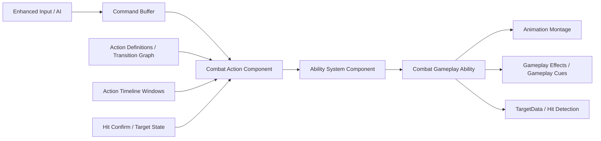
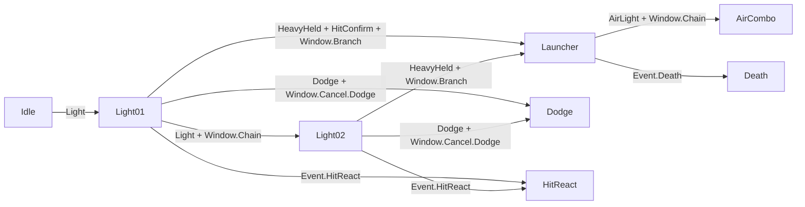
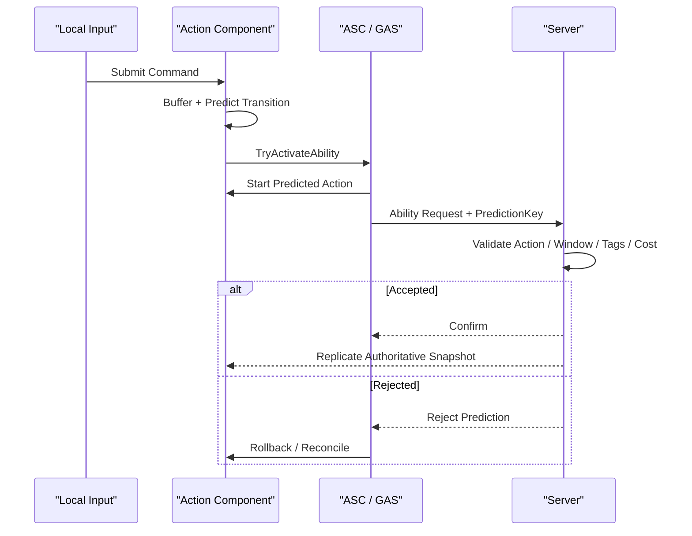
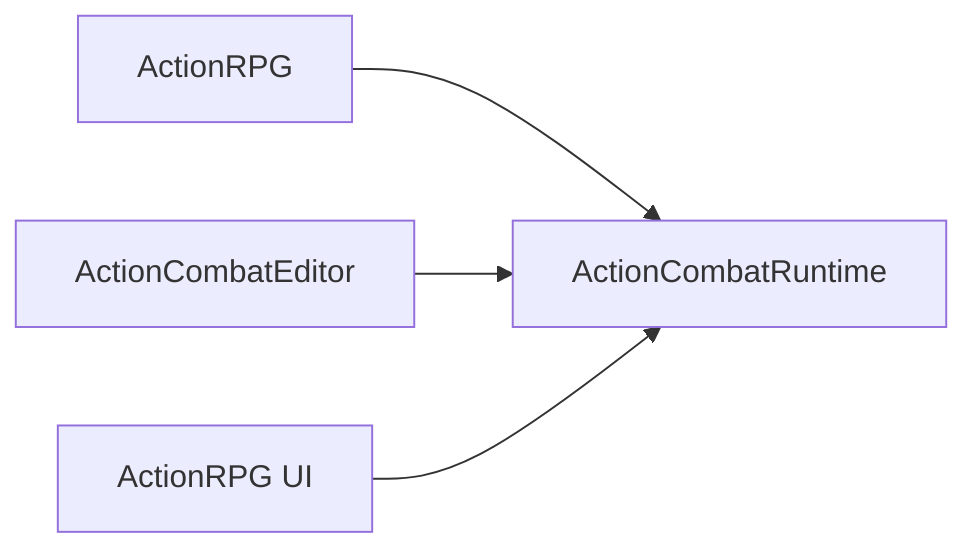

# 鬼泣/绝区零式动作系统架构思考

> 状态：架构草案，尚未实施<br>
> 项目基线：ActionRPG UE 5.7<br>
> 目标：在保留 Gameplay Ability System（GAS）能力的基础上，设计支持输入缓冲、连段打断、条件派生、空地动作和网络联机的动作系统。

## 导航

- 基线与原则：[当前 ActionRPG 的判断](#2-对当前-actionrpg-的判断)、[总体设计原则](#4-总体设计原则)。
- 核心运行时：[运行时对象与所有权](#5-运行时对象与所有权)、[静态数据模型](#6-静态数据模型)。
- 动作决策：[输入缓冲](#7-输入缓冲)、[动作图与转移模式](#8-动作图与转移模式)。
- UE/GAS 集成：[GAS 集成策略](#9-gas-集成策略)、[动画架构](#10-动画架构)。
- 时间与战斗：[时间与“帧”模型](#11-时间与帧模型)、[命中检测与效果结算](#12-命中检测与效果结算)。
- 联机：[网络联机架构](#13-网络联机架构)、[角色切换与援助系统](#14-角色切换与援助系统可选扩展)。
- 工程落地：[资产制作与验证](#15-资产制作与验证)、[模块边界](#16-模块边界)、[实施路线](#17-实施路线)。
- 验收与决策：[测试矩阵](#18-测试矩阵)、[常见反模式](#19-常见反模式)、[已确定决策与开放问题](#20-已确定决策与开放问题)。

## 1. 文档范围

本文描述的是一类高速第三人称动作系统的工程架构，不尝试复刻任何商业游戏的内部实现。

目标能力包括：

- 普通连段排队。
- 在合法窗口内提前取消当前动作。
- 根据轻击、重击、长按、方向、命中、空地状态和资源等条件派生。
- 闪避、格挡、受击、死亡等不同优先级的强制转移。
- 玩家、AI 共用同一套动作请求与转移规则。
- 支持服务器权威、本地预测和错误校正。
- 以稳定的动作时间轴表达“前摇、有效、后摇、取消窗口”等帧数据。
- 让动画师能直观编辑时间窗口，同时不把 Anim Notify 变成战斗状态机。

本文不直接规定：

- 最终战斗数值与具体招式内容。
- 摄像机、锁定系统和敌人 AI 的完整实现。
- 竞技格斗游戏级别的确定性回滚。
- 角色切换、援助攻击的最终产品规则。

## 2. 对当前 ActionRPG 的判断

### 2.1 可以保留的地基

ActionRPG 已经具备以下基础：

- `URPGAbilitySystemComponent` 已创建并启用复制。
- `ARPGCharacterBase` 能按 Ability Handle 或 GameplayTag 请求激活能力。
- GameplayAbility、GameplayEffect、AttributeSet 和 GameplayTag 已接入。
- `URPGAbilityTask_PlayMontageAndWaitForEvent` 能播放 Montage，并监听 GameplayEvent、完成、混出、中断和取消。
- Ability 取消时可以停止由该 Ability 播放的 Montage。

相关代码：

- [`RPGCharacterBase.cpp`](../Source/ActionRPG/Private/RPGCharacterBase.cpp)
- [`RPGAbilitySystemComponent.cpp`](../Source/ActionRPG/Private/Abilities/RPGAbilitySystemComponent.cpp)
- [`RPGAbilityTask_PlayMontageAndWaitForEvent.cpp`](../Source/ActionRPG/Private/Abilities/RPGAbilityTask_PlayMontageAndWaitForEvent.cpp)

### 2.2 当前连段方案的限制

从 `BP_PlayerCharacter`、`JumpSectionNS` 和攻击 Montage 中的节点/字段可见，当前方案主要依靠：

1. 输入激活近战 Ability。
2. Ability 播放包含多个攻击 Section 的 Montage。
3. Anim Notify State 打开连段输入期。
4. 蓝图记录是否收到下一次攻击输入。
5. `Montage_SetNextSection` 修改当前 Section 结束后的去向。

这适合线性连段，但没有把以下概念建模为独立系统：

- 通用输入缓冲。
- 动作节点与转移边。
- 立即取消、排队转移和强制转移。
- Hit Confirm、方向、长按、空地等转移条件。
- 多个请求竞争时的统一优先级。
- 本地预测、服务器验证和客户端回滚。

结论不是“GAS 做不到”，而是“当前连段蓝图没有提供通用动作转移层”。

## 3. 核心术语

| 术语 | 定义 |
| --- | --- |
| Action | 一个具有独立进入、执行和结束语义的战斗动作，例如 `Light01`、`Launcher`、`Dodge`。 |
| Action Definition | 描述动作静态配置的数据资产。 |
| Action Instance | 某次具体动作执行，拥有唯一序列号和运行时状态。 |
| Command | 由玩家输入或 AI 产生的标准化动作意图。 |
| Transition | 从当前 Action 到目标 Action 的有条件连接。 |
| Window | 动作时间轴上的一个区间，例如攻击有效期、连段期、闪避取消期。 |
| Hit Confirm | 当前动作已经由服务器确认命中合法目标。 |
| Action Frame | 项目约定的虚拟动作时间单位，例如 60Hz；不是渲染帧。 |
| Prediction | 客户端在服务器确认前先执行可回滚的动作表现。 |
| Reconciliation | 客户端收到服务器结果后确认、修正或撤销预测。 |

## 4. 总体设计原则

### 4.1 三层职责

> 动画负责表现和提供时间标记。<br>
> GAS 负责 Ability 生命周期、状态、资源和效果。<br>
> Action Component 负责输入缓冲与动作转移决策。



### 4.2 唯一事实来源

不得让 Montage、AnimBP、Action Component 和 ASC 各自维护一套互相竞争的“当前动作”。

- Action Component 是“动作转移状态”的事实来源。
- ASC 是“Ability 是否激活、结束、取消”的事实来源。
- 当前动作只在目标 Ability 激活成功后提交。
- Ability 结束时，通过 `ActionInstanceId` 清理对应实例。
- AnimBP 只消费动作状态，不反向决定战斗规则。

### 4.3 数据驱动优先

动作、窗口和转移关系应来自数据资产。蓝图用于特殊表现和个别招式扩展，不负责重复搭建通用转移流程。

### 4.4 事件驱动优先

输入到达、窗口变化、命中确认、状态变化和动作结束时触发求值。除确实需要连续轨迹采样外，不依赖无条件 Actor Tick 扫描所有动作关系。

## 5. 运行时对象与所有权

| 对象 | 建议所有者 | 生命周期 | 主要职责 |
| --- | --- | --- | --- |
| `UCombatActionComponent` | Character/Pawn | 跟随当前战斗角色 | 输入缓冲、动作实例、窗口、转移选择、预测状态。 |
| `UCombatAbilitySystemComponent` | Character 或 PlayerState | 取决于角色切换/重生需求 | Ability、Tag、Effect、PredictionKey、网络入口。 |
| `UCombatActionDefinition` | Primary Data Asset | 资产生命周期 | 单个动作静态配置。 |
| `UCombatActionSet` | Primary Data Asset | 资产生命周期 | 某角色、武器或姿态可用动作集合。 |
| `UCombatHitComponent` | Character/Weapon | 跟随战斗实体 | 武器轨迹、目标去重、构造 TargetData。 |
| `UCombatPartyComponent` | PlayerState/Controller，可选 | 跟随玩家会话 | 角色切换、援助窗口、当前可控角色。 |

### 5.1 Action Component 的最小公开职责

建议公开的概念接口只有：

- 提交标准化 Command。
- 查询当前 Action 和 Action Instance。
- 查询某 Window 是否开放。
- 请求或验证 Action Transition。
- 接收 Ability 激活、结束、取消和 Hit Confirm 回调。
- 发布只读的动作状态变更事件。

窗口匹配、优先级排序、缓冲消费、预测记录和回滚细节保持为内部实现。

### 5.2 ASC 的扩展职责

自定义 ASC 负责：

- 根据 ActionId 找到对应的 Ability Spec Handle。
- 统一接收本地预测动作请求。
- 通过标准 GAS 激活路径生成和使用 PredictionKey。
- 传输 GameplayEvent、Input Event 或 TargetData。
- 管理动作 Ability 的激活组。
- 把服务器确认/拒绝通知给 Action Component。

Action Component 不应另建一套与 GAS 无关的“激活动作 RPC”。

## 6. 静态数据模型

### 6.1 Combat Command

一个 Command 至少包含：

| 字段 | 含义 |
| --- | --- |
| `CommandTag` | `Input.Attack.Light`、`Input.Dodge` 等。 |
| `TriggerType` | Pressed、Released、Held。 |
| `LocalTimestamp` | 输入发生的本地时间，用于缓冲和诊断。 |
| `SequenceId` | 单调递增的输入编号，用于去重和网络关联。 |
| `Direction` | 输入发生时的角色或镜头相对方向。 |
| `HoldDuration` | 长按持续时间。 |
| `TargetHint` | 可选的目标提示，不作为服务器可信事实。 |

Command 不直接引用具体 Montage，也不直接调用某个攻击蓝图。

### 6.2 Action Definition

建议字段：

| 分类 | 字段示例 |
| --- | --- |
| 身份 | `ActionId`、`ActionTag`、版本。 |
| 执行 | Ability Class、Ability Level、Activation Group。 |
| 动画 | Montage、Start Section、Slot、Play Rate、Blend 配置。 |
| 状态 | Required Tags、Blocked Tags、Owned Tags。 |
| 时间 | 设计帧率、Startup/Active/Recovery、Window 列表。 |
| 位移 | Root Motion 策略、Motion Warping、速度保留策略。 |
| 命中 | Hit Profile、每目标命中次数、命中事件。 |
| 转移 | 从此动作出发的 Transition 列表。 |

`ActionId` 应使用稳定标识，例如 GameplayTag 或 PrimaryAssetId；不要把数组下标作为长期资产身份。

### 6.3 Transition

一条 Transition 表达“在什么条件下，可以从当前 Action 前往哪个 Action”。

建议字段：

- 目标 `ActionId`。
- 触发 CommandTag 或强制 GameplayEventTag。
- Required WindowTag。
- Required/Blocked GameplayTags 或 GameplayTagQuery。
- 是否要求 Hit Confirm。
- Grounded/Airborne 条件。
- 方向、长按和资源条件。
- Priority。
- Transition Mode。
- 成功后是否消费输入。
- 失败后输入是否继续保留。
- Montage 退出、Root Motion 和速度处理策略。

简单条件优先使用结构体、枚举、数值和 GameplayTagQuery。只有真正复杂、需要复用的判断才引入条件对象，避免出现大量只有一行逻辑的 UObject 类。

## 7. 输入缓冲

### 7.1 缓冲不是一个 bool

`bPressedAttack` 只能表达“发生过输入”，无法表达：

- 输入何时发生。
- 按下还是松开。
- 长按多久。
- 当时的方向。
- 是否已经被某次转移消费。
- 是否仍在有效缓冲时间内。

因此缓冲应是一个有上限的 Command 队列或环形缓冲区。

### 7.2 缓冲处理规则

1. 输入或 AI 决策生成 Command。
2. Command 进入缓冲，并记录过期时间。
3. Action Component 对当前动作的可用 Transition 求值。
4. 多条 Transition 合法时，按优先级和明确的稳定规则排序。
5. 只有目标 Ability 激活成功后才消费 Command。
6. 激活失败时，根据 Transition 配置保留或丢弃 Command。
7. 过期 Command 被移除。

### 7.3 何时重新求值

- 新 Command 到达。
- Window 打开或关闭。
- Hit Confirm 到达。
- 角色 Grounded/Airborne 状态改变。
- 必要资源或 GameplayTag 改变。
- 当前 Action 完成、取消或被打断。

## 8. 动作图与转移模式

### 8.1 三类转移

| 模式 | 语义 | 示例 |
| --- | --- | --- |
| Queued | 先缓冲，达到连接点后执行。 | `Light01 -> Light02`。 |
| Immediate | 合法窗口内立即取消当前 Action。 | 攻击取消到闪避或升龙。 |
| Forced | 忽略普通连段规则的高优先级转移。 | 受击、处决、死亡。 |

`Montage_SetNextSection` 主要适合 Queued。Immediate 必须显式结束/取消当前 Ability，并启动目标 Ability；Forced 还需要覆盖普通动作的阻塞规则。

### 8.2 示例动作图



### 8.3 优先级原则

建议默认优先级从高到低为：

1. Death。
2. Execution/Cinematic Control。
3. HitReact/Stun/GuardBreak。
4. Parry/Dodge/Emergency Cancel。
5. Special Branch。
6. Normal Combo Chain。
7. 返回 Locomotion/Idle。

具体游戏可调整，但排序必须集中定义，不能散落在多个蓝图执行顺序中。

### 8.4 转移事务

立即转移不能简单写成“先取消旧 Ability，再尝试新 Ability”，否则新 Ability 激活失败时会留下空状态。

建议流程：

1. 预检查目标动作和 Ability。
2. 创建新的 `TransitionSequenceId`。
3. 标记 Pending Transition。
4. 通过激活组规则替换旧 Ability。
5. 新 Ability 激活成功后提交新 Action Instance。
6. 激活失败则撤销 Pending 状态，并执行回退策略。
7. 旧 Ability 的结束回调只有在 InstanceId 匹配时才能清理状态。

## 9. GAS 集成策略

### 9.1 推荐粒度

建议“一次语义动作对应一次 GameplayAbility 激活”，例如：

- `Light01`
- `Light02`
- `Launcher`
- `Dodge`
- `HitReact`

不要求每个动作都有一份完全独立的 Ability 蓝图。普通攻击可以共用一个 C++ `UCombatActionAbility`，通过 Ability Spec 的 SourceObject 或其他稳定绑定取得 Action Definition；特殊动作再派生专用 Ability。

### 9.2 Ability 激活组

建议在自定义 ASC 中增加概念上的激活组：

| 激活组 | 行为 |
| --- | --- |
| Independent | 可与战斗 Action 并行，例如被动监听能力。 |
| Exclusive.Replaceable | 普通攻击、技能，可被合法转移替换。 |
| Exclusive.Blocking | 眩晕、处决、死亡，阻止普通 Action。 |

转移图决定“何时允许请求替换”，ASC 激活组决定“替换时如何一致地结束旧 Ability”。

### 9.3 GameplayTag 的使用边界

适合 Tag 表达的内容：

- `State.Grounded`
- `State.Stunned`
- `State.Invulnerable`
- `Action.Attack.Light`
- `Window.Cancel.Dodge`
- `Event.Combat.Hit.Confirmed`

不适合 Tag 表达的内容：

- 当前动作经过了 0.233 秒。
- 输入长按了 0.27 秒。
- 当前动作实例序列号。
- 根运动缩放值。
- 精确伤害和位移数值。

Tag 用于分类和条件匹配，不应替代完整运行时数据模型。

## 10. 动画架构

### 10.1 Locomotion 与 Action 的关系

建议 AnimGraph 分层：

1. Locomotion State Machine 生成基础姿势。
2. FullBody Slot 播放占用全身的攻击、闪避、受击。
3. UpperBody Slot 播放允许下半身继续移动的动作。
4. Additive 层处理受击抖动、瞄准和局部修正。
5. IK/Motion Warping 在明确的后处理阶段运行。

攻击 Montage 不需要成为 Locomotion 状态机中的一个状态。两者不会天然冲突，真正需要管理的是 Slot 占用、Blend、Root Motion 和 Ability 优先级。

### 10.2 Montage 的职责

Montage 负责：

- 动画片段编排。
- Section 和入口位置。
- Blend In/Out。
- Root Motion 动画。
- 面向动画师的时间标记。

Montage 不负责：

- 决定下一个语义 Action。
- 保存权威输入缓冲。
- 判断伤害是否成立。
- 决定死亡能否被闪避取消。

### 10.3 Anim Notify 的职责

Anim Notify/Notify State 可以发出：

- 音效、粒子和拖尾。
- `Window.HitActive.Open/Close`。
- `Window.Cancel.Dodge.Open/Close`。
- `Window.Chain.Open/Close`。
- Motion Warping 目标更新提示。

Notify 不应直接：

- 硬编码目标 Ability。
- 直接执行 `Montage_SetNextSection` 选择连段。
- 在客户端直接结算伤害。
- 独立维护一份当前动作状态。

关键 gameplay Notify 若仍在运行时直接使用，应选择更精确的 Montage Branching Point，并确保 Dedicated Server 会触发。普通音画事件可使用 Queued Notify。

### 10.4 立即取消的动画出口

每条 Immediate Transition 都需要定义：

- 当前 Montage Blend Out 时间。
- 目标 Montage Blend In 时间。
- 是否使用 Inertialization。
- Root Motion 是否立即终止。
- 是否保留当前速度。
- 是否应用新的 Root Motion Source。
- 是否需要 Motion Warping 对齐目标。

“逻辑上允许取消”不等于“动画上自然”。动作出口姿势与位移政策属于 Transition 数据的一部分。

## 11. 时间与“帧”模型

### 11.1 四种时间概念

| 概念 | 含义 | 是否作为战斗权威 |
| --- | --- | --- |
| Render Frame | GPU 显示的一张画面。 | 否。 |
| Game Tick | 游戏线程的一次更新，通常是可变步长。 | 承载逻辑。 |
| Animation Sample Frame | Animation Sequence 的姿势采样点。 | 否。 |
| Action Frame | 项目定义的虚拟动作时间单位。 | 是设计语义。 |

### 11.2 推荐定义

统一约定：

```text
Action Design Rate = 60 Hz
ActionTimeSeconds = ActionFrame / 60
ActionFrame = floor(ActionTimeSeconds * 60)
```

“前摇 10 帧”因此表示 `10 / 60 = 166.67ms`，与显示器刷新率和 Animation Sequence 的导入采样率无关。

### 11.3 运行时按时间推进

Action Runtime 保存 `PreviousActionTime` 和 `CurrentActionTime`。每次逻辑更新处理整个跨越区间：

```text
(PreviousActionTime, CurrentActionTime]
```

如果一次 Tick 从动作帧 10 跨到 12，必须处理第 11、12 帧之间所有窗口边界，不能只判断 `CurrentFrame == 11`。

Animation Sequence 和 Montage 也按播放时间推进并在当前时间求值姿势。高性能客户端会显示更多中间姿势，但不会更快播完动画。

### 11.4 时间数据的单一来源

推荐工作流：

1. 动画师在 Montage 中摆放自定义 Action Window Notify State。
2. 编辑器验证或烘焙工具读取 Begin/End 时间。
3. 把窗口转换成 Action Definition 使用的稳定时间表。
4. 运行时 Action Component 按时间区间求值。
5. Montage Notify 继续承担音画表现和开发期校验。

这样既保留动画时间轴的编辑体验，又避免运行时完全依赖 Notify 回调、可见性和动画更新策略。

### 11.5 动态播放倍率与 Hit Stop

如果动作支持攻速、慢动作和 Hit Stop，不能只保存 `ServerStartTime` 并假设 PlayRate 永远不变。

Action Clock 应显式记录：

- 当前动作逻辑时间。
- 当前 Action Rate。
- Rate 变化的生效时间和序列号。
- 暂停/恢复状态。

Montage 使用相同倍率跟随 Action Clock，必要时做小幅位置校正。战斗窗口跟随 Action Clock，而不是渲染画面是否已经显示到某姿势。

## 12. 命中检测与效果结算

### 12.1 推荐流程

1. Action Timeline 打开 HitActive Window。
2. Hit Component 记录武器 Socket 或攻击体上一时刻位置。
3. 本次逻辑更新执行 Swept Trace，覆盖上一位置到当前位置。
4. 使用 `ActionInstanceId + HitId + TargetId` 去重。
5. 构造 `FGameplayAbilityTargetDataHandle`。
6. 服务器验证目标、距离、阵营和状态。
7. GameplayAbility 通过 GameplayEffect 应用伤害、韧性和状态。
8. 服务器产生 Hit Confirm，供后续派生判断。

### 12.2 权威边界

- 客户端可预测拖尾、轻微停顿、镜头和命中特效。
- 服务器权威确认命中、伤害、击飞、资源和状态。
- 客户端发送的目标只能作为 Hint，不是最终事实。
- 瞬时伤害不应依赖客户端预测回滚。

### 12.3 Dedicated Server 骨骼更新

如果服务器命中检测依赖武器 Socket，服务器必须刷新必要的骨骼姿势。只推进 Montage 时间但不刷新骨骼，会让 Trace 使用陈旧 Socket Transform。

需要根据预算选择并验证 `EVisibilityBasedAnimTickOption`。依赖精确 Socket 的角色通常需要 `AlwaysTickPoseAndRefreshBones`，或在 Montage 播放期间刷新骨骼的模式。

## 13. 网络联机架构

### 13.1 三种网络角色

| 网络角色 | 行为 |
| --- | --- |
| Server/Authority | 权威验证 Transition、Ability、命中、资源和最终 Action State。 |
| Autonomous Proxy | 保存本地输入缓冲，预测自己的 Action 和 Montage，等待服务器确认。 |
| Simulated Proxy | 不进行输入和动作决策，只表现服务器复制结果。 |

### 13.2 推荐预测流程



标准路径应优先使用 GAS 的 Local Predicted Ability 激活。额外的方向、蓄力、目标和输入序号通过该 Ability 关联的 TargetData、GameplayEvent 或自定义 ASC 上下文传递，不另建彼此无关的激活协议。

### 13.3 服务器验证

服务器至少重新检查：

- 请求者是否拥有该 Ability。
- 当前权威 Action 是否允许这条 Transition。
- Required/Blocked Tags。
- 服务器时间窗口与允许的延迟容差。
- Grounded/Airborne、目标、距离与方向。
- 资源、Cooldown 和 Activation Group。
- Command Sequence 是否重复或过旧。

客户端时间戳只用于延迟估算与窗口容差，不能直接覆盖服务器时间。

### 13.4 状态分类

| 状态 | 归属 | 是否复制 |
| --- | --- | --- |
| 本地 Command Buffer | Autonomous Proxy | 不直接复制整个队列。 |
| 服务器 Command/Request 记录 | Server | 不向模拟代理复制。 |
| Predicted Candidate Transition | Autonomous Proxy | 否。 |
| Active Ability、Tag、Effect | ASC/GAS | 按 GAS 复制策略。 |
| Action Net Snapshot | Server Action Component | 粗粒度复制。 |
| Window Open/Close | 由 Action Timeline 推导 | 不逐窗口复制。 |
| 当前 Action Frame | 由时间推导 | 不逐帧复制。 |
| Damage/Hit Result | Server | 通过权威属性、效果和 Cue 传播。 |

### 13.5 Action Net Snapshot

建议只复制重建和校正所需的粗粒度数据：

```text
ActionId
ActionSequenceId
ServerStartTime
MontageVariant / StartSection
ActionRate
Optional TargetId
Correction Flags
```

不要每帧复制当前 Action Frame、Window bool 或整个输入队列。客户端利用相同 Action Definition 和服务器时间估计推导细节。

Snapshot 是服务器已确认 Ability 状态的投影，不是第二套独立状态机。Montage 若已经由 ASC 播放和复制，`OnRep_ActionState` 不应再无条件播放同一 Montage 两次。

### 13.6 预测确认与回滚

每个预测 Action 至少关联：

- `CommandSequenceId`。
- `ActionSequenceId`。
- GAS PredictionKey。
- 来源 Action InstanceId。

服务器确认时，将预测实例升级为权威实例。服务器拒绝时：

1. 取消预测 Ability。
2. 回滚可预测 GameplayEffect、Tag 和 GameplayCue。
3. 清理预测窗口与命中缓存。
4. 恢复服务器 Action Snapshot。
5. 校正 Montage Position 和角色位移。

伤害等不可安全预测回滚的结果只在服务器提交。

### 13.7 移动与 Root Motion

- 普通角色移动继续使用 CharacterMovement 的预测与校正。
- 冲刺、击退等位移优先使用 CharacterMovement 或 Root Motion Source。
- 不要让客户端动作蓝图直接以 `SetActorLocation` 提交权威位移。
- Montage Root Motion 由服务器权威，并验证不同延迟下的位置校正。
- Motion Warping 目标必须来自权威目标或可校正的预测目标。

### 13.8 ASC 所在对象

这是项目早期必须决定的问题：

- ASC 放在 Character：每个 Pawn 自己拥有独立 Ability、属性和状态，结构直接。
- ASC 放在 PlayerState：重生或换 Pawn 后仍能保留 Ability、Cooldown 和属性，但 ActorInfo 初始化更复杂。
- 多角色切换：可以每个角色拥有独立 ASC，再由 PlayerState/Party Component 管理控制权；也可以共享玩家 ASC，但必须明确属性和持续效果属于玩家还是角色。

无论选择哪种方式，本地预测要求 ASC 的 OwnerActor/AvatarActor 和网络 Owner 链正确初始化。

## 14. 角色切换与援助系统（可选扩展）

若目标包含类似快速换人、援助攻击、招架支援的机制，单个 Character 上的 Action Component 不足以决定全队行为。

建议增加服务器权威的 Party/Combat Coordinator，负责：

- 当前可控角色。
- 角色切换冷却和资源。
- Assist Window。
- 待机角色的空间位置和入场点。
- 输入所有权迁移。
- 摄像机目标切换请求。

Coordinator 不直接播放 Montage，而是向目标角色提交标准 Combat Command 或激活对应 GameplayAbility。

## 15. 资产制作与验证

### 15.1 Action Set

每个角色、武器或战斗姿态拥有一个 Action Set：

```text
Character Base Action Set
    + Weapon Action Set
    + Style/Stance Overrides
    + Temporary Buff/Transformation Overrides
```

运行时合并后形成当前可用动作映射。冲突覆盖顺序必须确定且可调试。

### 15.2 编辑器验证规则

建议为 Action Definition/Set 增加 Data Validation：

- ActionId 唯一且有效。
- Transition 目标存在。
- Required Window 存在。
- Window 起止时间合法，且不超过动作时长。
- 同条件、同优先级的 Transition 不产生不确定结果。
- Ability Class、Montage、Section 和 Slot 有效。
- Root Motion/Movement 策略完整。
- Forced Action 不会被低优先级 Action 反向取消。
- 网络预测动作不包含客户端不可回滚的权威修改。
- 动作图不存在意外的永不退出循环。

### 15.3 调试可视化

运行时建议显示：

- Current ActionId / ActionSequenceId。
- Action Time / Action Frame / PlayRate。
- 当前开放 WindowTags。
- Command Buffer 内容与剩余寿命。
- 候选 Transition 及拒绝原因。
- Active Ability Handle / PredictionKey。
- Server 与 Client 动作时间差。
- Hit Trace、HitId 和去重结果。

## 16. 模块边界

### 16.1 学习阶段

当前项目只有 `ActionRPG` Runtime 模块和 LoadingScreen 模块。第一阶段可保持单模块，在 `Source/ActionRPG` 内按职责建立目录：

```text
Combat/
    Actions/
    Animation/
    Input/
    Network/
    Targeting/
    Debug/
```

这样能减少早期资产类路径迁移和 Build.cs 调整。

### 16.2 稳定后的目标模块

| 模块 | 职责 | 主要依赖 |
| --- | --- | --- |
| `ActionCombatRuntime` | Action 数据、Action Component、基础 Ability、AbilityTask、Hit 与网络契约。 | Core、Engine、GameplayAbilities、GameplayTags、GameplayTasks。 |
| `ActionRPG` | 具体角色、武器、输入映射、AI 和游戏资产。 | ActionCombatRuntime、EnhancedInput、AIModule。 |
| `ActionCombatEditor` | 资产验证、窗口烘焙、动作图和调试工具。 | ActionCombatRuntime、UnrealEd、DataValidation。 |
| UI 模块，可选 | HUD、输入提示、动作调试界面。 | Runtime 的只读接口。 |

目标依赖方向：



`ActionCombatRuntime` 不反向依赖具体角色、武器蓝图或 UI，防止循环依赖。

## 17. 实施路线

### Phase 0：固定现有行为

- 记录 ActionRPG 当前轻攻击输入、Combo Notify 和 Section 跳转流程。
- 建立攻击时间线、Montage Section 和 GameplayEvent 的调试日志。
- 保留当前方案作为行为对照。

### Phase 1：单机最小闭环

- 实现标准 Combat Command 和有限输入缓冲。
- 实现 Action Component 和 Action InstanceId。
- 只做 `Light01`、`Light02`、`Launcher`、`Dodge` 四个动作。
- 支持 Queued 和 Immediate 两种 Transition。

### Phase 2：数据驱动

- 引入 Action Definition、Transition 和 Action Set。
- 把 JumpSections 与硬编码蓝图条件迁移为数据。
- 增加编辑器验证与运行时调试显示。

### Phase 3：GAS 深度集成

- 建立通用 Combat Action Ability。
- 建立 Ability 激活组。
- 将命中、Hit Confirm、资源和状态统一接入 GAS。
- 处理取消事务和失败回退。

### Phase 4：联机

- Local Predicted Ability。
- Action Net Snapshot。
- Server Transition Validation。
- PredictionKey、ActionSequenceId 和回滚。
- Dedicated Server 骨骼、Root Motion 和命中测试。

### Phase 5：高级动作能力

- 空中连段、蓄力、方向派生。
- Motion Warping 与目标吸附。
- Hit Stop 和动态 Action Rate。
- 换人、援助与团队协调器。
- 必要时评估更完整的固定步长/回滚模拟。

## 18. 测试矩阵

### 18.1 帧率与时间

- 客户端 30、60、120、144 FPS。
- 服务器 30 与 60 Tick Rate。
- 单帧卡顿跨越多个 Action Frame。
- 动态 PlayRate、慢动作、暂停和 Hit Stop。

### 18.2 网络

- 0、50、100、200ms 延迟。
- 1%、5%、10% 丢包。
- 延迟抖动和乱序。
- Listen Server 与 Dedicated Server。
- Late Join 与网络相关性重新进入。
- 客户端预测成功与服务器拒绝。

### 18.3 动作竞争

- 连段与闪避在同一逻辑帧到达。
- HitReact 与攻击派生同时发生。
- Death 覆盖所有低优先级 Action。
- 旧 Ability End 回调晚于新 Ability 激活。
- Montage 被外部 Montage 覆盖。
- 目标 Ability 预检查通过但实际 Commit 失败。

### 18.4 命中

- 低 Tick Rate 下高速武器轨迹。
- 一次 Action 对同一目标的重复去重。
- 多目标与多段攻击。
- Dedicated Server Socket Transform。
- 客户端预测命中特效与服务器未命中的回滚。

## 19. 常见反模式

- 用 Montage Section 名称充当完整动作状态。
- 用一个 bool 充当输入缓冲。
- 让 Anim Notify 直接选择和激活具体下一招。
- 让 AnimBP 成为战斗规则的事实来源。
- 每帧复制 Action Frame 和窗口 bool。
- 客户端直接提交伤害或权威位移。
- Action Component 与 ASC 各自发送一套无关联激活 RPC。
- 取消旧 Ability 后才检查新 Ability 能否激活。
- 用 `CurrentFrame++` 绑定渲染帧推进动作。
- 用数组下标作为持久 ActionId。
- 把所有动态数值都编码成 GameplayTag。

## 20. 已确定决策与开放问题

### 20.1 当前建议决策

- 保留 GAS 作为 Ability、状态、效果和网络预测基础。
- 新增 Action Component 作为动作转移仲裁层。
- 一个语义 Action 对应一次 Ability 激活。
- 普通 Action 使用通用 Ability + Action Definition，特殊 Action 再派生。
- 统一使用 60Hz 虚拟 Action Frame 表达设计时间。
- 运行时按逻辑时间区间处理窗口，不依赖渲染帧。
- 服务器权威命中、伤害、资源与最终 Action State。
- Montage 是表现时间轴，不是动作状态机。

### 20.2 实施前需要选择

- ASC 放在 Character 还是 PlayerState。
- 输入请求完全复用 GAS Event/TargetData，还是扩展自定义 ASC 请求结构。
- 动作窗口以 DataAsset 为原始数据，还是以 Montage Notify 为原始数据并在编辑期烘焙。
- 服务器目标 Tick Rate。
- 是否需要角色级 Hit Stop，还是全局/局部时间膨胀。
- Root Motion 与 Motion Warping 的权威政策。
- 目标是合作 PvE 的服务器权威预测，还是竞技模式的固定步长/回滚。
- 何时从单一 `ActionRPG` 模块拆分为 Runtime/Editor 模块。

## 21. 参考资料

### 项目代码

- [`RPGCharacterBase.h`](../Source/ActionRPG/Public/RPGCharacterBase.h)
- [`RPGCharacterBase.cpp`](../Source/ActionRPG/Private/RPGCharacterBase.cpp)
- [`RPGAbilitySystemComponent.h`](../Source/ActionRPG/Public/Abilities/RPGAbilitySystemComponent.h)
- [`RPGAbilityTask_PlayMontageAndWaitForEvent.h`](../Source/ActionRPG/Public/Abilities/RPGAbilityTask_PlayMontageAndWaitForEvent.h)
- [`RPGAbilityTask_PlayMontageAndWaitForEvent.cpp`](../Source/ActionRPG/Private/Abilities/RPGAbilityTask_PlayMontageAndWaitForEvent.cpp)
- [`ActionRPG.Build.cs`](../Source/ActionRPG/ActionRPG.Build.cs)

### Unreal Engine 官方资料

- [Gameplay Ability System](https://dev.epicgames.com/documentation/en-us/unreal-engine/understanding-the-unreal-engine-gameplay-ability-system)
- [Using Gameplay Abilities](https://dev.epicgames.com/documentation/unreal-engine/using-gameplay-abilities-in-unreal-engine)
- [Animation Notifies](https://dev.epicgames.com/documentation/en-us/unreal-engine/animation-notifies-in-unreal-engine)
- [Animation Montages](https://dev.epicgames.com/documentation/en-us/unreal-engine/animation-montage-in-unreal-engine)
- [Animation Sequences](https://dev.epicgames.com/documentation/unreal-engine/animation-sequences-in-unreal-engine)
- [Visibility Based Animation Tick](https://dev.epicgames.com/documentation/unreal-engine/API/Runtime/Engine/EVisibilityBasedAnimTickOption)
- [Network Emulation](https://dev.epicgames.com/documentation/unreal-engine/using-network-emulation-in-unreal-engine)
